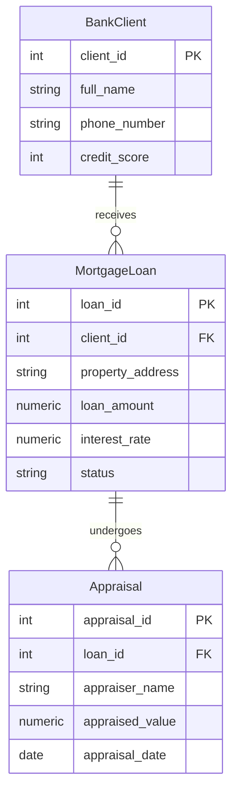
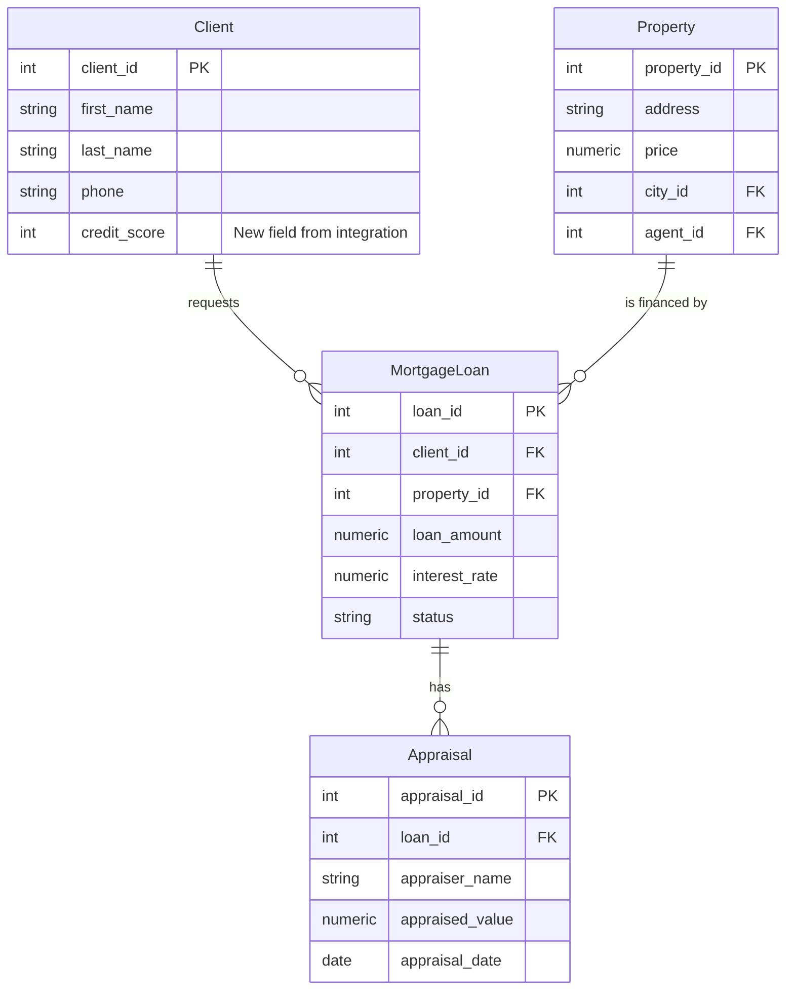

# דוח הפרויקט שלב ג' - אינטגרציה ומבטים
**הוגש ע"י:** איתן דוד וייס ואריה זבולון הכהן

## 1. החלטות שנעשו בשלב האינטגרציה
בשלב האינטגרציה קיבלנו מערכת בנק משכנתאות (Mortgage Bank) הכוללת את הטבלאות: לקוחות בנק (BankClient), הלוואות משכנתא (MortgageLoan) ושמאויות (Appraisal). 
ההחלטות שקיבלנו כדי למזג את בסיס הנתונים:
1. **מיזוג טבלת הלקוחות:** במקום להחזיק טבלת `BankClient` נפרדת מהטבלה המקורית שלנו (`Client`), החלטנו להוסיף לטבלת `Client` הקיימת את השדה `credit_score` (דירוג אשראי) וכך לאחד את הייצוג של לקוח במערכת ולמנוע כפילות.
2. **החלפת טקסט חופשי במפתח זר:** במערכת הבנק המקורית, כתובת הנכס נשמרה כטקסט חופשי בטבלת המשכנתאות. החלטנו לבטל את השדה הזה, ובמקומו יצרנו קשר (Foreign Key) מטבלת `MortgageLoan` לטבלת `Property` במערכת שלנו (`property_id`).
3. **הוספת טבלאות לווין:** הוספנו את טבלאות `MortgageLoan` ו-`Appraisal` למערכת שלנו וקישרנו אותן לישויות הקיימות (`Client` ו-`Property`).

## 2. הסבר מילולי של התהליך והפקודות
התהליך בוצע על ידי הרצת הפקודות בקובץ `Integrate.sql`:
* תחילה, השתמשנו בפקודת `ALTER TABLE Client` כדי להוסיף את העמודה `credit_score` עם אילוץ `CHECK` לטווח ציוני האשראי התקין (300-850).
* לאחר מכן, יצרנו באמצעות `CREATE TABLE` את טבלת `MortgageLoan`, שכוללת מפתחות זרים המפנים אל טבלת הלקוחות והנכסים המקורית שלנו באמצעות אילוצי `FOREIGN KEY`. הוספנו גם `ON DELETE CASCADE` כדי לשמור על שלמות הנתונים.
* יצרנו את טבלת `Appraisal` המקושרת לטבלת המשכנתאות.
* לבסוף, השתמשנו בפקודות `UPDATE` כדי להוסיף ציוני אשראי ללקוחות קיימים, ובפקודות `INSERT` כדי להכניס נתוני משכנתא ושמאויות המקושרים לאותם לקוחות ונכסים.

---

## 3. תרשימי ERD / DSD

### תרשים המערכת של אגף בנק המשכנתאות (לפני האינטגרציה)



### תרשים משולב - לאחר האינטגרציה (המערכת המאוחדת)



*(הערה: הוסר ה-BankClient ומוזג אל תוך Client, וכתובת הנכס הפכה לקשר ל-Property).*

---

## 4. מבטים (Views) ושאילתות משולבות

### מבט 1: נקודת מבט של סוכנות הנדל"ן (`AgentPropertyMortgageView`)
**תיאור מילולי:** המבט משלב את נתוני הנכס (ממערכת 1), שם הסוכן שמטפל בו (ממערכת 1), וסטטוס המשכנתא של הקונה (ממערכת 2). זה מאפשר לסוכנים לראות במהירות לאילו נכסים יש כבר רוכשים עם משכנתא מאושרת, ומאילו נכסים נדרש להמשיך לחפש רוכשים אחרים.

**תוצאות המבט (`SELECT * FROM AgentPropertyMortgageView`):**
| property_id | property_address | asking_price | agent_name | mortgage_status | loan_amount |
|-------------|------------------|--------------|------------|-----------------|-------------|
| 1 | Herzl 10, Tel Aviv | 2500000 | Yossi Cohen | Approved | 1500000.00 |
| 2 | Ben Gurion 5, Haifa | 1800000 | Dana Levi | Pending | 800000.00 |

#### שאילתא 1 על מבט הנדל"ן: נכסים עם משכנתא מאושרת
**תיאור מילולי:** השאילתא מסננת את המבט כדי להציג אך ורק את הנכסים שבהם הקונה קיבל אישור סופי למשכנתא.
```sql
SELECT * FROM AgentPropertyMortgageView WHERE mortgage_status = 'Approved';
```
**תוצאה:**
| property_id | property_address | asking_price | agent_name | mortgage_status | loan_amount |
|-------------|------------------|--------------|------------|-----------------|-------------|
| 1 | Herzl 10, Tel Aviv | 2500000 | Yossi Cohen | Approved | 1500000.00 |

#### שאילתא 2 על מבט הנדל"ן: נכסים של סוכן ספציפי
**תיאור מילולי:** מציגה את מצב המשכנתאות של נכסים המטופלים ע"י הסוכן יוסי כהן.
```sql
SELECT property_id, property_address, mortgage_status, asking_price 
FROM AgentPropertyMortgageView WHERE agent_name = 'Yossi Cohen' ORDER BY asking_price DESC;
```
**תוצאה:**
| property_id | property_address | mortgage_status | asking_price |
|-------------|------------------|-----------------|--------------|
| 1 | Herzl 10, Tel Aviv | Approved | 2500000 |

---

### מבט 2: נקודת המבט של הבנק (`ComprehensiveLoanView`)
**תיאור מילולי:** המבט מציג את נתוני ההלוואות (ממערכת 2) יחד עם שם הלקוח ודירוג האשראי שלו (ממערכת 1), וכתובת הנכס. כמו כן, מחשב "הון עצמי" (הפרש בין הערכת שמאי מגובה הלוואה) כדי להעריך סיכון.

**תוצאות המבט (`SELECT * FROM ComprehensiveLoanView`):**
| loan_id | client_name | credit_score | property_address | loan_amount | appraised_value | equity |
|---------|-------------|--------------|------------------|-------------|-----------------|--------|
| 1001 | Avi Peretz | 750 | Herzl 10, Tel Aviv | 1500000.00 | 1600000.00 | 100000.00 |
| 1002 | Michal Ziv | 680 | Ben Gurion 5, Haifa| 800000.00 | 850000.00 | 50000.00 |

#### שאילתא 1 על מבט הבנק: הלוואות בטוחות (Equity גבוה)
**תיאור מילולי:** איתור הלוואות בטוחות בהן ההון העצמי (הפער) גבוה מ-90,000 ש"ח.
```sql
SELECT loan_id, client_name, loan_amount, appraised_value, equity 
FROM ComprehensiveLoanView WHERE equity > 90000;
```
**תוצאה:**
| loan_id | client_name | loan_amount | appraised_value | equity |
|---------|-------------|-------------|-----------------|--------|
| 1001 | Avi Peretz | 1500000.00 | 1600000.00 | 100000.00 |

#### שאילתא 2 על מבט הבנק: לקוחות בעלי דירוג אשראי גבוה
**תיאור מילולי:** הלוואות שניתנו ללקוחות בעלי דירוג אשראי מעל 700.
```sql
SELECT loan_id, client_name, credit_score, loan_amount 
FROM ComprehensiveLoanView WHERE credit_score > 700;
```
**תוצאה:**
| loan_id | client_name | credit_score | loan_amount |
|---------|-------------|--------------|-------------|
| 1001 | Avi Peretz | 750 | 1500000.00 |
